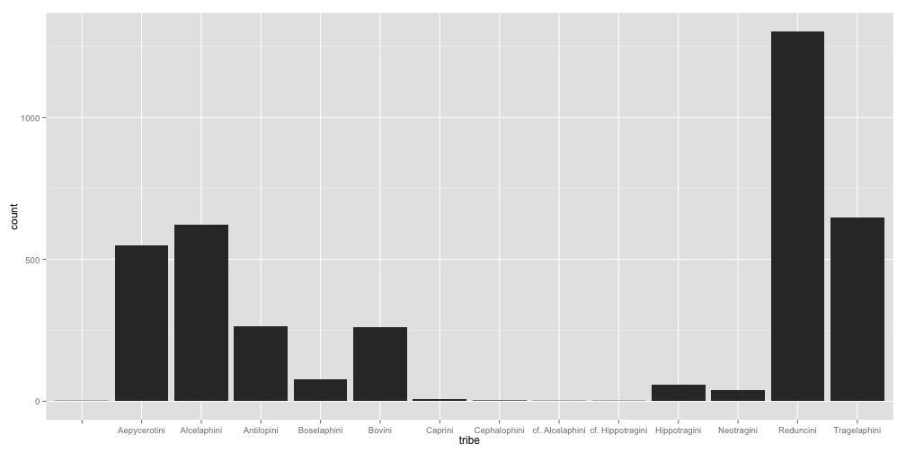

Using the Paleocore R API Interface - Turkana Analysis
========================================================


## Preliminaries


```r
library(devtools)
install_github("paleocore/paleocoreR")
library(paleocoreR)
library(ggplot2)
```


## Pull down all the bovids


```r
bovids <- getPCdata(project = "turkana", family = "Bovidae", limit = 0)
```

```
## Loading required package: httr
```

```r
qplot(data = bovids, x = tribe)
```

 

