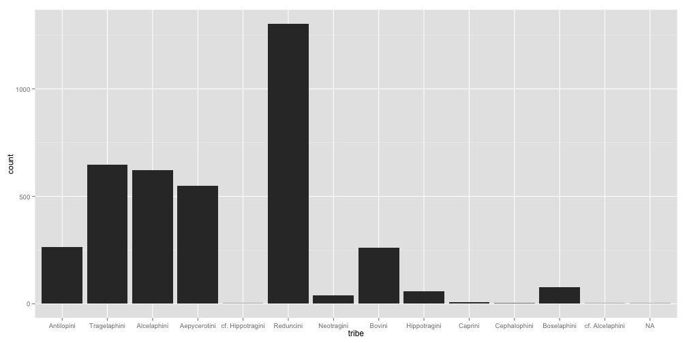

Using the Paleocore R API Interface
========================================================

This demo shows the functionality of the PaleoCore API using the Turkana dataset as an example. 

## Preliminaries
The PaleocoreR package is not yet on CRAN, so you cannot install it using the normal R package installation method.  Instead you can use a function called `install_github()` from the `devtools` package to install the package from the [paleocoreR github page](http://paleocore.github.com/paleocoreR), as shown below.


```r
library(devtools)
install_github("paleocore/paleocoreR")
library(paleocoreR)

# also load the ggplot2 package for graphing.  If this package is not
# installed already you can try install.packages('ggplot2')
library(ggplot2)
```

## First, we can check which resources are available


```r
getPCresources()
```

```
## Loading required package: httr
## Loading required package: rjson
## The following resources are available through the PaleoCore API.
```

```
## [1] drp_occurrence: Requires api_key authentication.
## [1] drp_taxonomy: Requires api_key authentication.
## [1] turkana: Publicly available resource
```


## Authentication

Some datasets require authentication (turkana does not).  You can store your PaleoCore username and api_key for authentication using the convenience function `setPCcredentials()`.  If you have a paleocore login account, you can obtain your api_key at [http://paleocore.org/apikey](http://paleocore.org/apikey). If you need to create a login account please [contact the paleocore administrators](http://paleocore.org/about). 


```r
setPCcredentials(username = "proconsul", api_key = "s93jsp9823jd83mw2md922d93kd73f23kdf23ld7")
```


## See which fields can be filtered on in the Turkana dataset


```r
getPCfilters(resource = "turkana")
```

```
## The following fields from the turkana resource can be passed as query filters using getPCdata().
```

```
##  [1] "age"                   "age_estimate"         
##  [3] "age_max"               "age_min"              
##  [5] "body_element"          "body_element_code"    
##  [7] "body_size"             "class_field"          
##  [9] "collecting_area"       "color"                
## [11] "date_entered"          "excavation"           
## [13] "family"                "family_code"          
## [15] "formation"             "genus"                
## [17] "genus_code"            "genus_qualifier"      
## [19] "identifier"            "level"                
## [21] "locality"              "matrix"               
## [23] "member"                "order"                
## [25] "part_description"      "publication_author"   
## [27] "remarks"               "sex"                  
## [29] "side"                  "signed"               
## [31] "species"               "species_qualifier"    
## [33] "specimen_number"       "square_number"        
## [35] "storage_location"      "stratigraphic_code"   
## [37] "stratigraphic_unit"    "study_area"           
## [39] "subfamily"             "surface"              
## [41] "tribe"                 "tribe_code"           
## [43] "weathering"            "year_found"           
## [45] "year_identified"       "year_published"       
## [47] "year_published_suffix"
```

```
## Example usage:
## age='somevalue'
## age__exact='somevalue'
## age__contains='somevalue'
## age__lt='somevalue'
## age__gt='somevalue'
## age__startswith='somevalue'
## age__endswith='somevalue'
```


## Getting data using `getPCdata()`

The workhorse function of the `paleocoreR` package is called `getPCdata()`.  Here we will download all of the bovid records from the turkana dataset.  

```r
bovids <- getPCdata(resource = "turkana", family = "Bovidae", limit = 0)
str(bovids)
```

```
## 'data.frame':	3836 obs. of  99 variables:
##  $ ldc                  : logi  NA NA NA NA NA NA ...
##  $ ldp4                 : logi  NA NA NA NA NA NA ...
##  $ ldp1                 : logi  NA NA NA NA NA NA ...
##  $ ldp2                 : logi  NA NA NA NA NA NA ...
##  $ ldp3                 : logi  NA NA NA NA NA NA ...
##  $ area_modifier        : Factor w/ 65 levels ""," 103.0"," 2.0",..: 1 1 1 1 1 1 58 58 1 1 ...
##  $ age_min              : logi  NA NA NA NA NA NA ...
##  $ age_max              : logi  NA NA NA NA NA NA ...
##  $ specimen_prefix      : Factor w/ 4 levels "ER","KP","LT",..: 1 1 1 1 1 1 4 4 2 2 ...
##  $ year_published       : int  1991 1991 1991 1991 1991 1991 1988 1988 2003 2003 ...
##  $ lc                   : logi  NA NA NA NA NA NA ...
##  $ udp4                 : logi  NA NA NA NA NA NA ...
##  $ udp3                 : logi  NA NA NA NA NA NA ...
##  $ udp2                 : logi  NA NA NA NA NA NA ...
##  $ udp1                 : logi  NA NA NA NA NA NA ...
##  $ latitude             : logi  NA NA NA NA NA NA ...
##  $ up4                  : logi  NA NA NA NA NA NA ...
##  $ up2                  : logi  NA NA NA NA NA NA ...
##  $ up3                  : logi  NA NA NA NA NA NA ...
##  $ udi2                 : logi  NA NA NA NA NA NA ...
##  $ udi3                 : logi  NA NA NA NA NA NA ...
##  $ part_description     : Factor w/ 568 levels "","almost complete",..: 528 422 528 309 44 528 97 31 525 59 ...
##  $ subfamily            : logi  NA NA NA NA NA NA ...
##  $ field_number         : Factor w/ 2414 levels ""," 0.0"," 1450.0",..: 1321 365 366 366 366 366 1816 1817 2398 2409 ...
##  $ level                : Factor w/ 8 levels "","Between marker tuff and GWF",..: 1 1 1 1 1 1 1 1 1 1 ...
##  $ stratigraphic_unit   : Factor w/ 64 levels "","?Upper deltaic sands",..: 1 1 1 1 1 1 1 1 28 54 ...
##  $ ldi3                 : logi  NA NA NA NA NA NA ...
##  $ ldi2                 : logi  NA NA NA NA NA NA ...
##  $ ldi1                 : logi  NA NA NA NA NA NA ...
##  $ identifier           : logi  NA NA NA NA NA NA ...
##  $ side                 : Factor w/ 6 levels "","Lt.","Lt. and Rt.",..: 4 1 2 2 2 2 4 2 4 4 ...
##  $ year_identified      : logi  NA NA NA NA NA NA ...
##  $ excavation           : logi  NA NA NA NA NA NA ...
##  $ lm1                  : logi  NA NA NA NA NA NA ...
##  $ lm2                  : logi  NA NA NA NA NA NA ...
##  $ lm3                  : logi  NA NA NA NA NA NA ...
##  $ sex                  : logi  NA NA NA NA NA NA ...
##  $ signed               : logi  NA NA NA NA NA NA ...
##  $ genus_code           : logi  NA NA NA NA NA NA ...
##  $ matrix               : logi  NA NA NA NA NA NA ...
##  $ body_size            : logi  NA NA NA NA NA NA ...
##  $ age_estimate         : logi  NA NA NA NA NA NA ...
##  $ tribe_code           : int  3 12 3 3 3 3 3 2 12 12 ...
##  $ formation            : Factor w/ 9 levels "Galana Boi","Kanapoi",..: 1 1 1 1 1 1 1 1 2 2 ...
##  $ year_published_suffix: Factor w/ 2 levels "","a": 2 2 2 2 2 2 1 1 1 1 ...
##  $ um1                  : logi  NA NA NA NA NA NA ...
##  $ collecting_area      : num  100 105 105 105 105 105 NA NA NA NA ...
##  $ um3                  : logi  NA NA NA NA NA NA ...
##  $ um2                  : logi  NA NA NA NA NA NA ...
##  $ ui3                  : logi  NA NA NA NA NA NA ...
##  $ genus                : Factor w/ 29 levels "","Aepyceros",..: 12 26 12 12 12 12 12 1 26 26 ...
##  $ air_photo            : logi  NA NA NA NA NA NA ...
##  $ tribe                : Factor w/ 14 levels "","Aepycerotini",..: 4 14 4 4 4 4 4 3 14 14 ...
##  $ family               : Factor w/ 1 level "Bovidae": 1 1 1 1 1 1 1 1 1 1 ...
##  $ color                : logi  NA NA NA NA NA NA ...
##  $ date_entered         : logi  NA NA NA NA NA NA ...
##  $ museum               : Factor w/ 1 level "KNM": 1 1 1 1 1 1 1 1 1 1 ...
##  $ study_area           : Factor w/ 4 levels "East Turkana",..: 1 1 1 1 1 1 4 4 2 2 ...
##  $ specimen_number      : int  4803 1461 1628 1628 1631 1632 14933 14588 29261 30486 ...
##  $ y_coordinate         : logi  NA NA NA NA NA NA ...
##  $ udc                  : logi  NA NA NA NA NA NA ...
##  $ publication_author   : Factor w/ 3 levels "J. Harris","J. Harris et al.",..: 1 1 1 1 1 1 3 3 2 2 ...
##  $ square_number        : Factor w/ 7 levels ""," 209.0"," 301.0",..: 1 1 1 1 1 1 1 1 1 1 ...
##  $ weathering           : logi  NA NA NA NA NA NA ...
##  $ body_element         : Factor w/ 76 levels "","Astragalus",..: 11 6 11 34 11 11 34 24 11 11 ...
##  $ up1                  : logi  NA NA NA NA NA NA ...
##  $ longitude            : logi  NA NA NA NA NA NA ...
##  $ udi1                 : logi  NA NA NA NA NA NA ...
##  $ year_found           : int  1975 1972 1972 1972 1972 1972 1984 1984 1994 1995 ...
##  $ stratigraphic_code   : logi  NA NA NA NA NA NA ...
##  $ family_code          : int  63 63 63 63 63 63 63 63 63 63 ...
##  $ uc                   : logi  NA NA NA NA NA NA ...
##  $ surface              : logi  NA NA NA NA NA NA ...
##  $ specimen_suffix      : Factor w/ 155 levels ""," 0.0","A",..: 1 1 3 46 1 1 1 1 1 1 ...
##  $ id                   : int  1984 3912 3924 3925 3926 3927 9030 9054 8938 8908 ...
##  $ locality             : Factor w/ 56 levels "","15 yds from 60-66K",..: 28 23 23 23 23 23 51 51 1 1 ...
##  $ lp4                  : logi  NA NA NA NA NA NA ...
##  $ lp3                  : logi  NA NA NA NA NA NA ...
##  $ lp2                  : logi  NA NA NA NA NA NA ...
##  $ lp1                  : logi  NA NA NA NA NA NA ...
##  $ species              : Factor w/ 51 levels "","acalla","altidens",..: 33 49 33 33 33 33 1 1 22 22 ...
##  $ member               : Factor w/ 33 levels "","Apak","Burgi",..: 1 1 1 1 1 1 1 1 13 19 ...
##  $ x_coordinate         : logi  NA NA NA NA NA NA ...
##  $ storage_location     : logi  NA NA NA NA NA NA ...
##  $ genus_qualifier      : Factor w/ 4 levels "","?","cf.","indet.": 1 1 1 1 1 1 1 4 1 1 ...
##  $ ui1                  : logi  NA NA NA NA NA NA ...
##  $ body_element_code    : int  27 28 27 30 27 27 30 13 27 27 ...
##  $ ui2                  : logi  NA NA NA NA NA NA ...
##  $ record_number        : int  NA NA 1 2 NA NA NA NA NA NA ...
##  $ remarks              : logi  NA NA NA NA NA NA ...
##  $ class_field          : Factor w/ 1 level "Mammalia": 1 1 1 1 1 1 1 1 1 1 ...
##  $ gps_datum            : logi  NA NA NA NA NA NA ...
##  $ age                  : logi  NA NA NA NA NA NA ...
##  $ li1                  : logi  NA NA NA NA NA NA ...
##  $ li2                  : logi  NA NA NA NA NA NA ...
##  $ li3                  : logi  NA NA NA NA NA NA ...
##  $ species_qualifier    : Factor w/ 4 levels "","aff.","cf.",..: 1 1 1 1 1 1 4 1 1 1 ...
##  $ order                : Factor w/ 1 level "Artiodactyla": 1 1 1 1 1 1 1 1 1 1 ...
##  $ resource_uri         : Factor w/ 3836 levels "/API/v1/turkana/1/",..: 527 1326 1338 1339 1340 1341 2946 2970 2846 2813 ...
```


## Plot bovids by tribe

```r
qplot(data = bovids, x = tribe)
```

 


